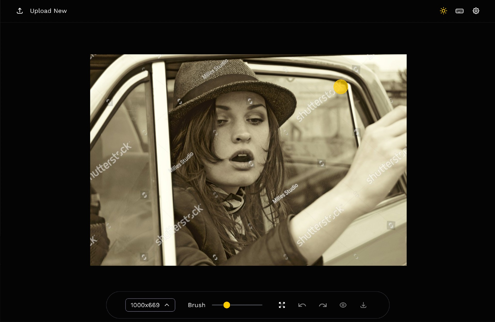
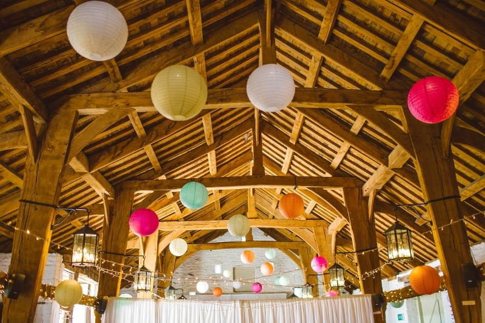
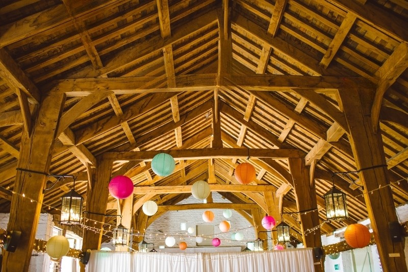
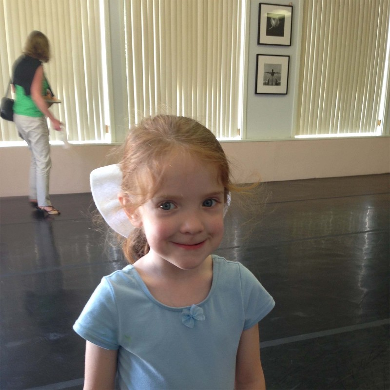
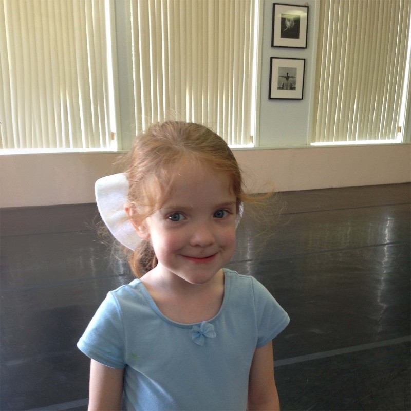
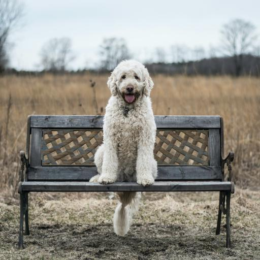

# Image inpainting tool powered by SOTA AI inpainting models

**Supports [LaMa](https://github.com/saic-mdal/lama) and [LDM](https://github.com/CompVis/latent-diffusion) model architectures**

Frontend and backend code modified from [Lama-Cleaner](https://github.com/Sanster/lama-cleaner). Improvements including automatic image segmentation and human body detection are currently in progress.



## Features

- Completely free and open-source
- Fully self-hosted
- Two SOTA AI models
  1. [LaMa](https://github.com/saic-mdal/lama)
  2. [LDM](https://github.com/CompVis/latent-diffusion)
- Supports CPU & GPU

## Usage

| Usage                  | Before                                        | After                                                          |
| ---------------------- | --------------------------------------------- | -------------------------------------------------------------- |
| Remove unwanted things |  |             |
| Remove unwanted person |   |              |
| Remove text            |              |                         |
| Remove watermark       |           |              |
| Fix old photo          |            |                 |
| Text driven inpainting |                       | Prompt: a fox sitting on a bench<br/>  |

## Quick Start

```bash
pip install lama-cleaner

# Model will be downloaded automatically
lama-cleaner --model=lama --device=cpu --port=8080
# Lama Cleaner is now running at http://localhost:8080
```

Available arguments:

| Name              | Description                                                                                              | Default  |
| ----------------- | -------------------------------------------------------------------------------------------------------- | -------- |
| --model           | lama/ldm. See details in [Inpaint Model](#inpainting-model)                                              | lama     |
| --hf_access_token | stable-diffusion(sd) model need huggingface access token https://huggingface.co/docs/hub/security-tokens |          |
| --device          | cuda or cpu                                                                                              | cuda     |
| --port            | Port for backend flask web server                                                                        | 8080     |
| --gui             | Launch lama-cleaner as a desktop application                                                             |          |
| --gui_size        | Set the window size for the application                                                                  | 1200 900 |
| --input           | Path to image you want to load by default                                                                | None     |
| --debug           | Enable debug mode for flask web server                                                                   |          |

## Inpainting Model

| Model | Description                                                                                                                                                                                                            | Config                                                                                                                                                                                                                                                                            |
| ----- | ---------------------------------------------------------------------------------------------------------------------------------------------------------------------------------------------------------------------- | --------------------------------------------------------------------------------------------------------------------------------------------------------------------------------------------------------------------------------------------------------------------------------- |
| LaMa  | :+1: Generalizes well on high resolutions(~2k)<br/>                                                                                                                                                                    |                                                                                                                                                                                                                                                                                   |
| LDM   | :+1: Possible to get better and more detail result <br/> :+1: The balance of time and quality can be achieved by adjusting `steps` <br/> :neutral_face: Slower than GAN model<br/> :neutral_face: Need more GPU memory | `Steps`: You can get better result with large steps, but it will be more time-consuming <br/> `Sampler`: ddim or [plms](https://arxiv.org/abs/2202.09778). In general plms can get [better results](https://github.com/Sanster/lama-cleaner/releases/tag/0.13.0) with fewer steps |

### LaMa vs LDM

| Original Image                                                                                                                            | LaMa                                                                                                                                                   | LDM                                                                                                                                                   |
| ----------------------------------------------------------------------------------------------------------------------------------------- | ------------------------------------------------------------------------------------------------------------------------------------------------------ | ----------------------------------------------------------------------------------------------------------------------------------------------------- |
|  |  |  |

## Inpainting Strategy

Lama Cleaner provides three ways to run inpainting model on images, you can change it in the settings dialog.

| Strategy     | Description                                                                                                                                    | VRAM                 |
| ------------ | ---------------------------------------------------------------------------------------------------------------------------------------------- | -------------------- |
| **Original** | Use the resolution of the original image                                                                                                       | :tada:               |
| **Resize**   | Resize the image to a smaller size before inpainting. Lama Cleaner will make sure that the area of the image outside the mask is not degraded. | :tada: :tada:        |
| **Crop**     | Crop masking area from the original image to do inpainting                                                                                     | :tada: :tada: :tada: |

## Download Model Mannually

If you have problems downloading the model automatically when lama-cleaner start,
you can download it manually. By default lama-cleaner will load model from `TORCH_HOME=~/.cache/torch/hub/checkpoints/`,
you can set `TORCH_HOME` to other folder and put the models there.

- Github:
  - [LaMa](https://github.com/Sanster/models/releases/tag/add_big_lama)
  - [LDM](https://github.com/Sanster/models/releases/tag/add_ldm)

## Development

Only needed if you plan to modify the frontend and recompile yourself.

### Frontend

Frontend code are modified from [cleanup.pictures](https://github.com/initml/cleanup.pictures), You can experience their
great online services [here](https://cleanup.pictures/).

- Install dependencies:`cd lama_cleaner/app/ && yarn`
- Start development server: `yarn start`
- Build: `yarn build`

## Docker

Run within a Docker container. Set the `CACHE_DIR` to models location path. Optionally add a `-d` option to
the `docker run` command below to run as a daemon.

### Build Docker image

```
docker build -f Dockerfile -t lamacleaner .
```

### Run Docker (cpu)

```
docker run -p 8080:8080 -e CACHE_DIR=/app/models -v  $(pwd)/models:/app/models -v $(pwd):/app --rm lamacleaner python3 main.py --device=cpu --port=8080
```

### Run Docker (gpu)

```
docker run --gpus all -p 8080:8080 -e CACHE_DIR=/app/models -v $(pwd)/models:/app/models -v $(pwd):/app --rm lamacleaner python3 main.py --device=cuda --port=8080
```

Then open [http://localhost:8080](http://localhost:8080)
